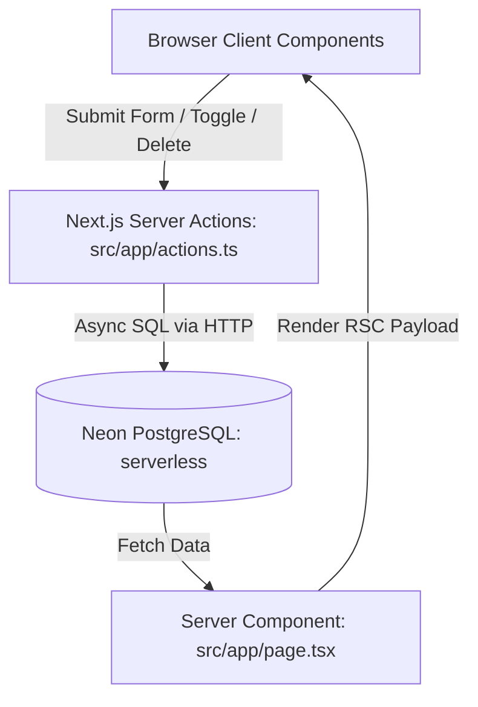

# PROJECT.md - Project Specification & Architectural Documentation

## 📌 Executive Summary

**Project Name**: TaskFlow Todo Application  
**Target Environment**: Node.js v22+  
**Core Technologies**: Next.js 16 (App Router), TypeScript, Tailwind CSS v4, Neon PostgreSQL (`@neondatabase/serverless`), Lucide Icons.

TaskFlow is a full-stack Todo application using a serverless Neon PostgreSQL database inside Next.js App Router with React Server Components and Server Actions.

---

## 🏗️ Architectural Overview

### Component Breakdown

1. **Database Layer (`src/lib/db.ts`)**
   - Utilizes `@neondatabase/serverless` (`neon` tagged-template) for async, serverless-compatible PostgreSQL queries over HTTP.
   - Exports an `initDb()` async function that runs `CREATE TABLE IF NOT EXISTS` on cold start.
   - No local database file — all data is stored in the Neon cloud project.

2. **Server Actions (`src/app/actions.ts`)**
   - Encapsulates database mutations (`addTodo`, `toggleTodo`, `deleteTodo`, `clearCompleted`).
   - Uses `revalidatePath('/')` to trigger real-time RSC re-rendering without full page reloads.

3. **User Interface (`src/components/`)**
   - **`StatsCard.tsx`**: Renders real-time statistics (total tasks, pending count, completed count, percentage bar).
   - **`TodoForm.tsx`**: Form component with input validation, priority selector, loading states, and instant feedback.
   - **`TodoList.tsx`**: Interactive list view with live search filtering, status tab navigation, priority badges, and item deletion.

---

## 💾 Database Schema

The database is hosted on [Neon](https://neon.tech) (serverless PostgreSQL). The connection string is read from the `DATABASE_URL` environment variable.

### `todos` Table Definition

| Field Name   | Data Type    | Constraints                  | Description                              |
|--------------|--------------|------------------------------|------------------------------------------|
| `id`         | `SERIAL`     | `PRIMARY KEY`                | Unique task identifier (auto-increment)  |
| `title`      | `TEXT`       | `NOT NULL`                   | Description/Title of the task            |
| `completed`  | `BOOLEAN`    | `DEFAULT FALSE`              | Task completion state                    |
| `task_type`  | `TEXT`       | `DEFAULT 'checkbox'`         | Task kind: `checkbox`, `time`, `input`, `number` |
| `type_value` | `TEXT`       | `DEFAULT ''`                 | Stored value for non-checkbox task types |
| `sort_order` | `INTEGER`    | `DEFAULT 0`                  | Manual drag-and-drop ordering position   |
| `created_at` | `TIMESTAMPTZ`| `DEFAULT NOW()`              | Creation timestamp with timezone         |

---

## 🔌 Server Action API Specifications

### 1. `getTodos(): Promise<Todo[]>`
- **Description**: Fetches all todo items sorted by creation timestamp in descending order.
- **SQL**: `SELECT * FROM todos ORDER BY created_at DESC`

### 2. `addTodo(formData: FormData)`
- **Parameters**: `title` (string), `priority` (`low` | `medium` | `high`)
- **Description**: Inserts a new task item into SQLite database.
- **SQL**: `INSERT INTO todos (title, priority) VALUES (?, ?)`

### 3. `toggleTodo(id: number, currentCompleted: boolean)`
- **Parameters**: `id` (task ID), `currentCompleted` (boolean)
- **Description**: Toggles completion state between 0 and 1.
- **SQL**: `UPDATE todos SET completed = ? WHERE id = ?`

### 4. `deleteTodo(id: number)`
- **Parameters**: `id` (task ID)
- **Description**: Deletes a specific task item by ID.
- **SQL**: `DELETE FROM todos WHERE id = ?`

### 5. `clearCompleted()`
- **Description**: Deletes all completed tasks in bulk.
- **SQL**: `DELETE FROM todos WHERE completed = 1`

---

## 🎨 Design System & Aesthetic Principles

- **Theme Palette**: Deep slate background (`#090d16`), vibrant indigo accents (`#6366f1`), glowing emerald badges (`#10b981`), and warning/danger colors (`#f59e0b`, `#f43f5e`).
- **Glassmorphism**: Translucent panels with backdrop blur (`backdrop-filter: blur(16px)`), subtle borders (`rgba(255, 255, 255, 0.08)`), and soft drop shadows.
- **Micro-Animations**: Smooth entry keyframe animations (`animate-fade-in`), smooth status bar transitions, and responsive hover feedback.

---

## 🔮 Future Enhancements & Roadmap

1. **Due Dates & Reminders**: Add `due_date` column to SQLite table with date picker.
2. **Category / Tags**: Allow tasks to be grouped into custom categories.
3. **Subtasks / Checklists**: Nested todo items with progress tracking.
4. **Drag-and-Drop Reordering**: Enable manual position ordering using custom sort field.
