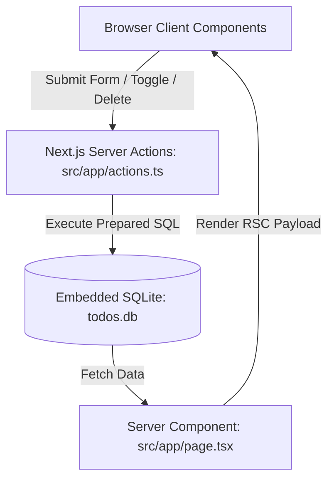

# PROJECT.md - Project Specification & Architectural Documentation

## 📌 Executive Summary

**Project Name**: TaskFlow SQLite Todo Application  
**Target Environment**: Node.js v22+  
**Core Technologies**: Next.js 16 (App Router), TypeScript, Tailwind CSS v4, SQLite (`better-sqlite3`), Lucide Icons.

TaskFlow is a full-stack, lightweight Todo application designed to demonstrate native, zero-config SQLite integration inside Next.js App Router using React Server Components and Server Actions.

---

## 🏗️ Architectural Overview

### Component Breakdown

1. **Database Layer (`src/lib/db.ts`)**
   - Utilizes `better-sqlite3` for fast, synchronous, embedded database queries.
   - Configures WAL (Write-Ahead Logging) mode for enhanced concurrency.
   - Automatically initializes table structure (`todos.db`) on application startup.

2. **Server Actions (`src/app/actions.ts`)**
   - Encapsulates database mutations (`addTodo`, `toggleTodo`, `deleteTodo`, `clearCompleted`).
   - Uses `revalidatePath('/')` to trigger real-time RSC re-rendering without full page reloads.

3. **User Interface (`src/components/`)**
   - **`StatsCard.tsx`**: Renders real-time statistics (total tasks, pending count, completed count, percentage bar).
   - **`TodoForm.tsx`**: Form component with input validation, priority selector, loading states, and instant feedback.
   - **`TodoList.tsx`**: Interactive list view with live search filtering, status tab navigation, priority badges, and item deletion.

---

## 💾 Database Schema

The SQLite database file `todos.db` is stored at the root of the project.

### `todos` Table Definition

| Field Name   | Data Type | Constraints                           | Description                          |
|--------------|-----------|---------------------------------------|--------------------------------------|
| `id`         | `INTEGER` | `PRIMARY KEY AUTOINCREMENT`           | Unique task identifier               |
| `title`      | `TEXT`    | `NOT NULL`                            | Description/Title of the task        |
| `completed`  | `INTEGER` | `DEFAULT 0`                           | 0 = Pending, 1 = Completed           |
| `priority`   | `TEXT`    | `DEFAULT 'medium'`                    | Task priority: `low`, `medium`, `high`|
| `created_at` | `DATETIME`| `DEFAULT CURRENT_TIMESTAMP`           | Creation timestamp                   |

---

## 🔌 Server Action API Specifications

### 1. `getTodos(): Promise<Todo[]>`
- **Description**: Fetches all todo items sorted by creation timestamp in descending order.
- **SQL**: `SELECT * FROM todos ORDER BY created_at DESC`

### 2. `addTodo(formData: FormData)`
- **Parameters**: `title` (string), `priority` (`low` | `medium` | `high`)
- **Description**: Inserts a new task item into SQLite database.
- **SQL**: `INSERT INTO todos (title, priority) VALUES (?, ?)`

### 3. `toggleTodo(id: number, currentCompleted: boolean)`
- **Parameters**: `id` (task ID), `currentCompleted` (boolean)
- **Description**: Toggles completion state between 0 and 1.
- **SQL**: `UPDATE todos SET completed = ? WHERE id = ?`

### 4. `deleteTodo(id: number)`
- **Parameters**: `id` (task ID)
- **Description**: Deletes a specific task item by ID.
- **SQL**: `DELETE FROM todos WHERE id = ?`

### 5. `clearCompleted()`
- **Description**: Deletes all completed tasks in bulk.
- **SQL**: `DELETE FROM todos WHERE completed = 1`

---

## 🎨 Design System & Aesthetic Principles

- **Theme Palette**: Deep slate background (`#090d16`), vibrant indigo accents (`#6366f1`), glowing emerald badges (`#10b981`), and warning/danger colors (`#f59e0b`, `#f43f5e`).
- **Glassmorphism**: Translucent panels with backdrop blur (`backdrop-filter: blur(16px)`), subtle borders (`rgba(255, 255, 255, 0.08)`), and soft drop shadows.
- **Micro-Animations**: Smooth entry keyframe animations (`animate-fade-in`), smooth status bar transitions, and responsive hover feedback.

---

## 🔮 Future Enhancements & Roadmap

1. **Due Dates & Reminders**: Add `due_date` column to SQLite table with date picker.
2. **Category / Tags**: Allow tasks to be grouped into custom categories.
3. **Subtasks / Checklists**: Nested todo items with progress tracking.
4. **Drag-and-Drop Reordering**: Enable manual position ordering using custom sort field.
